```{r setup, include=FALSE}
knitr::opts_chunk$set(echo = TRUE, paged.print=FALSE)
```

### Copyright

All the material presented here, to the extent it is original, is available under [CC-BY-SA](https://creativecommons.org/licenses/by-sa/4.0/). 

## Plan for 15-18 November 2022

### Tuesday 15/11

09:00-09:45 Jakub Nowosad (zoom) Q&A Finding systematic patterns in geographic space

10:00-11:00 Finding systematic patterns in variable/geographic space (exercises)

11:00-12:00 External libraries, links to GRASS GIS, raster/terra

13:00-13:30 Geodemographics

13:30-14:30 Links to GIS, raster/terra, geodemographics (exercises)

14:45-15:45 Spatio-temporal cubes, juridicial change


### Wednesday 16/11

09:00-10:00 Spatio-temporal cubes, juridicial change (exercises)

10:15-11:15 Global and local spatial autocorrelation 

11:15-12:00 Data puzzles (support)

13:00-14:15 Global and local spatial autocorrelation (exercises)

14:30-15:30 Residual autocorrelation (exercises)

### Thursday 17/11

09:00-10:15 Spatial autocorrelation and machine learning

10:30-11:30 Point pattern analysis

11:30-12:00 Point pattern analysis (exercises)

13:00-14:30 Transport, networks, transmission

14:45-15:45 Transport, networks, transmission (exercises)


### Friday 18/11

Depending on the number of participants wishing to present project outlines (about 25 minutes, 10-15 minutes presentation, 10-15 minutes discussion, the number of slots may vary.

09:00-12:00 Presentation of up to six project outlines, with 20 min. break.

12:30-15:30 Presentation of up to six project outlines, with 20 min. break.

15:30-16:00 Round-up and feedback


## External libraries, links to GRASS GIS, raster/terra

## FOSS foundations and barn-raising

Both R and GRASS are FOSS. Both build on FOSS foundations, GRASS directly and R through contributed packages that the user may choose to install in R libraries.

### Before barn-raising

So what are the shared FOSS foundations? Briefly, PROJ, GEOS and GDAL, first shown in the pre-barn-raising state:

```{r, out.width=800, echo=FALSE}
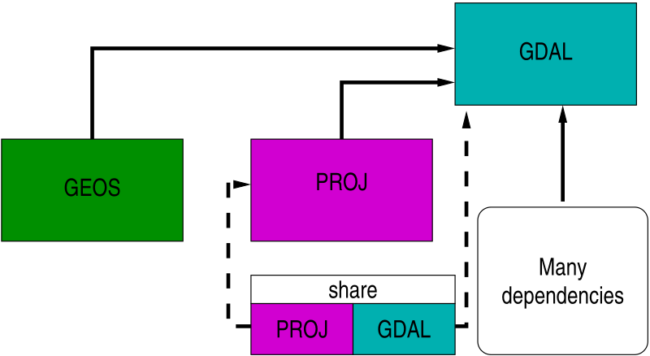
```

PROJ (then often called Proj4) provides coordinate reference systems (CRS) definitions, and projection and datum transformation operations; GEOS provides planar topological predicates and operations; GDAL provides abstractions for reading, writing, manipulating and transforming GIS data using drivers for raster and vector data.

PROJ < 6 and GDAL < 3 used to ship with shared flat text files providing metadata about coordinate reference systems. Pre-PROJ 6, PROJ 5 introduced pipelines for projection and datum transformation operations [@knudsen+evers17, @evers+knudsen17]. PROJ 4 had been stuck with an outdated WGS84 (World Geodetic System 1984 and `+towgs84=` key-value pairs) datum transformation hub introducing errors of up to 2m; all datum transformations were forced through WGS84 as an intermediate product.

### Barn-raising 

Following the Barn Raising project (https://gdalbarn.com/), PROJ 6 and GDAL 3 were released together, with GDAL 3 requiring PROJ >= 6. The most obvious changes were that PROJ now stored CRS, projection and transformation metadata in an SQLite database, also used by GDAL, and that most of the legacy flat text files were replaced by database tables. The database file made it much easier to adopt OGC WKT2 (2019) for specifying CRS. This provided the information needed to drop the WGS84 transformation hub in most cases, and to construct direct transformation pipelines from database lookup:


```{r, out.width=800, echo=FALSE}
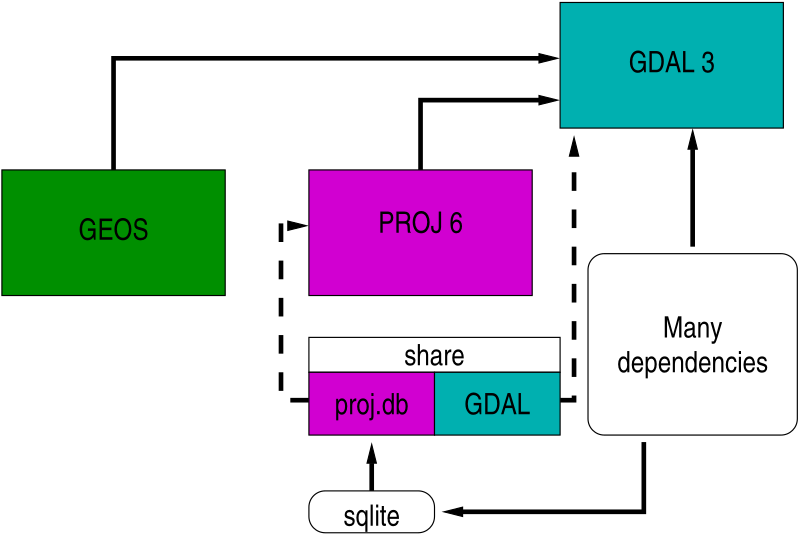
```

### CDN or bundle grid files?

The most accurate direct transformation pipelines may need transformation grids rather than 3 or 7 parameter transformation models applied equally over the area of interest. While the legacy `proj-datumgrid` zipfile never exceeded 6.3 MiB, the current `proj-data` zipfile is 562.5 MiB (https://download.osgeo.org/proj/). Since it is unlikely that users need transformation grids for all continents, one can download by continent (Oceania, North America, Europe), or for global transformations, but these are still all large. The volume of transformation grids released under permissive licenses and hosted by the CDN will continue to increase rapidly.

Instead of installing lots of unneeded grids, which may become stale, use can be made of an on-demand content download network https://cdn.proj.org from within PROJ, using CURL for download and TIFF as the unified grid format (Cloud Optimized GeoTiff). On-demand use creates a user-writeable `cache.db` SQLite database of grid chunks, which may be used across applications looking at the same `PROJ_LIB` directory:

```{r, out.width=800, echo=FALSE}
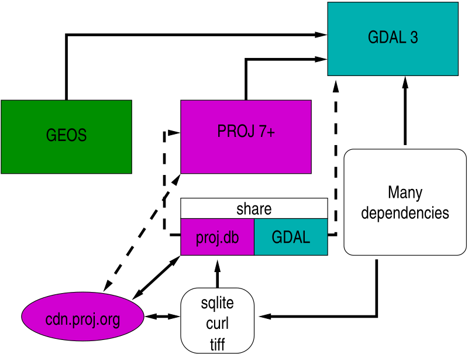
```

## Modernizing R packages

### Pre barn-raising

When the first R-GRASS interface package was written [@bivand:00], a small subset of GRASS GIS library was included in the R package **GRASS**, to permit GRASS 5 rasters to be read and written. When the R package **rgdal** became available, the next two interface iterations **spgrass6** for GRASS 6 and **rgrass7** for GRASS 7 used it to read and write temporary raster and vector files using GDAL. In addition to the GRASS interface packages, many other R packages used the functionality of PROJ and GDAL then provided by **rgdal**:

```{r, out.width=800, echo=FALSE}
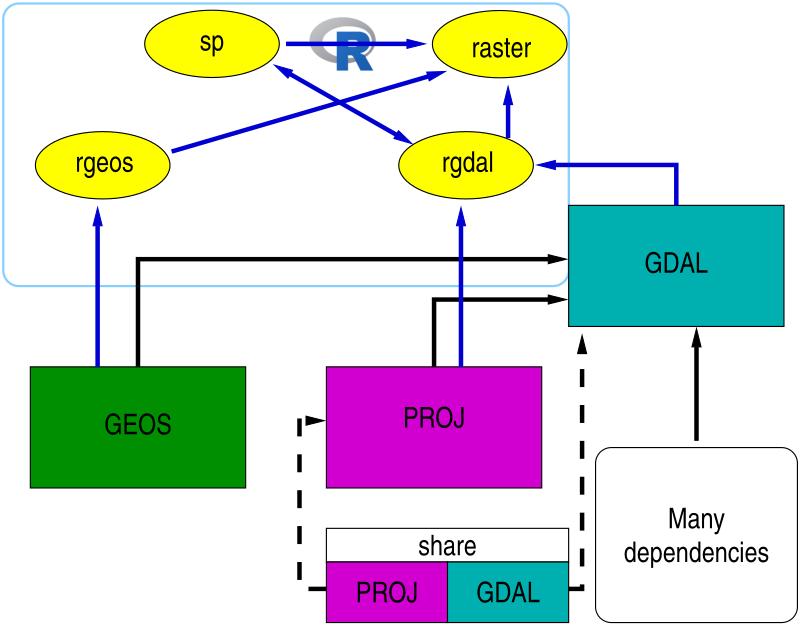
```

One complication on platforms such as Windows and macOS for which the R archive network provides binary packages, is that the PROJ and GDAL shared metadata files are bundled:

```{r, out.width=800, echo=FALSE}
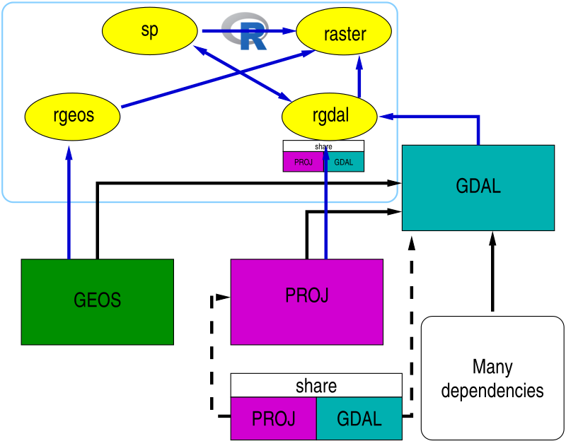
```

The versions of these metadata files may differ from those bundled with other binary software (such as OSGeo4W or the GRASS Windows standalone).

### Addressing barn-raising in R packages

@bivand:21 describes the steps taken to modernize **rgdal** as a useful place to prototype adaptations - see also @bivand:22. For vector data, the **sf** simple features package is strongly recommended for new work, while for vector and raster spatial and spatio-temporal arrays, **stars** may be used. Both of these are part of the informal `r-spatial` GitHub organization (https://r-spatial.org, https://github.com/r-spatial). **sf** links to PROJ, GDAL and GEOS, so is able to replace **rgdal** and **rgeos**. **rgdal** perhaps uses PROJ directly rather than PROJ through GDAL, but most of what was learned about changes in PROJ and GDAL is shared.

In addition, **rgdal** had been used extensively by the **raster** package, which itself did not link to external software libraries. **raster** is being re-implemented in the **terra** package, which is now almost complete. **terra**, like **sf**, links to PROJ, GDAL and GEOS, so provides the same file handling functionality as **rgdal** with regard to the R-GRASS interface, but for both vector and raster objects. **rgdal**, **sf** and **terra** can use the WKT2 (2019) CRS representation.

```{r, out.width=800, echo=FALSE}
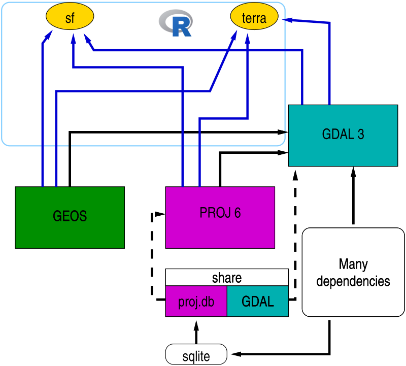
```

### GDAL RRASTER driver

GDAL has had an `RRASTER` raster driver to read and write files created by the R **raster** package since 2.2 (https://gdal.org/drivers/raster/rraster.html#raster-rraster). Until 3.5, the driver used Proj4 strings to represent CRS, but from 3.5.0 may also use WKT2 (2019) as the preferred representation (for **terra** and **raster**; the latter uses pure R code not GDAL). 

## Modernizing the R-GRASS interface 

### Choices and issues

Simply permitting the **rgrass7** package to interface GRASS 8 as well as GRASS 7 was not sufficient, because **rgdal** will be retired during 2023. So **rgrass** is the new interface package. It has been tested with GRASS 7.8.6 as well as GRASS 8. After examining the use of **sf** and **stars** compared to **terra**, it was found that of the packages providing services from PROJ, GEOS and GDAL, **terra** was a better fit, in having object structures more like traditional GIS. **sf** is innovating fast, including the use of **s2** for spherical geometry topology predicates and operations, and spatio-temporal arrays in **stars**; these may be needed later, but for now **terra** is a good fit for the needs of the interface:

```{r, out.width=800, echo=FALSE}
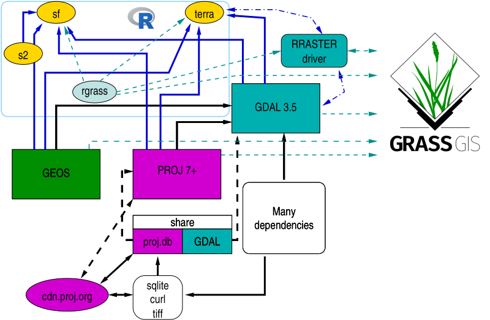
```

Before continuing to a proper description of the interface, one practical problem needs to be mentioned: bundling. R packages for Windows and macOS are built as static binary packages: if they contain compiled C, C++ or Fortran code linking to external software libraries like PROJ, GDAL or GEOS, they are statically linked to those libraries. This means not only that the versions of the external software libraries are fixed, but that (at present) each such R package also bundles a copy of the shared PROJ and GDAL metadata directories. The GRASS distributions for macOS and Windows (both stand-alone and OSGeo4W) bundle shared PROJ and GDAL metadata directories. The Windows distributions further bundle the complete PROJ set of transformation grids. 

```{r, out.width=800, echo=FALSE}
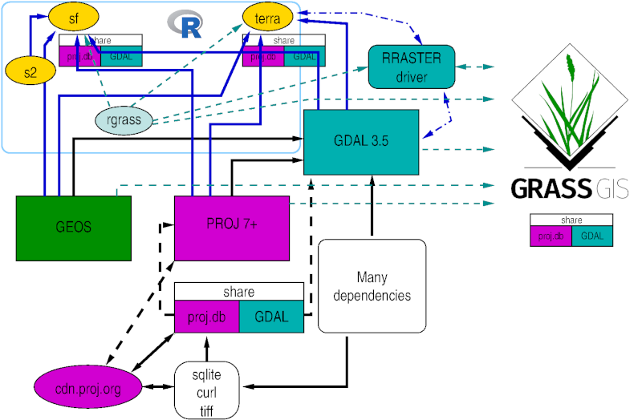
```

If the user is not careful, and if the underlying version of PROJ or GDAL is upgraded during an R minor version (say 4.2, during the calendar year approximately April to April), **sf** and **terra** may have different versions too. This has for example emerged in https://github.com/rsbivand/rgrass/issues/57; it would be useful if the internal PROJ function found in the issue was exposed in the API for downstream code (like R packages and GRASS) to use.

## Introduction to the interface

The original R-GRASS interface [@bivand:00; @neteler+mitasova:08] was written mainly to permit R objects represented as **sp** class objects to be moved to GRASS, and GRASS objects to be moved to R for statistical analysis. From **spgrass6** 0.6-3 (April 2009) following a fruitful workshop at Queen's University, Belfast, the interface was re-written to use the `--interface-description` flag provided for each GRASS command, also used by the Python interface to GRASS commands. Command interface descriptions are parsed from XML and cached as R objects for efficiency. The current version of the R-GRASS interface is **rgrass**. In addition, an R function `initGRASS()` was written to permit GRASS to be started from within R to which we will return below.

It is worth stating that the number of years that the current package maintainer can continue in that role is limited, and it would be excellent if the maintainer role is transferred at the latest during 2024 (that is, shortly after the retirement of **rgdal**, **rgeos** and **maptools**).

### Starting R inside GRASS

When starting GRASS GIS from a terminal console (here GRASS 8.2.0), one can continue in the GRASS terminal console, starting an interactive R session from there (here R 4.2.1). Loading and attaching the R-GRASS interface package **rgrass** in the R session, we see that the current GRASS location is detected and reported:

```
$ /home/rsb/topics/grass/g820/bin/grass /home/rsb/topics/grassdata/nc_basic_spm_grass7/rsb
Starting GRASS GIS...
Cleaning up temporary files...

          __________  ___   __________    _______________
         / ____/ __ \/   | / ___/ ___/   / ____/  _/ ___/
        / / __/ /_/ / /| | \__ \\_  \   / / __ / / \__ \
       / /_/ / _, _/ ___ |___/ /__/ /  / /_/ // / ___/ /
       \____/_/ |_/_/  |_/____/____/   \____/___//____/

Welcome to GRASS GIS 8.2.0
GRASS GIS homepage:                      https://grass.osgeo.org
This version running through:            Bash Shell (/bin/bash)
Help is available with the command:      g.manual -i
See the licence terms with:              g.version -c
See citation options with:               g.version -x
If required, restart the GUI with:       g.gui wxpython
When ready to quit enter:                exit

Launching <wxpython> GUI in the background, please wait...
GRASS nc_basic_spm_grass7/rsb:github-rsb > R

R version 4.2.1 (2022-06-23) -- "Funny-Looking Kid"
Copyright (C) 2022 The R Foundation for Statistical Computing
Platform: x86_64-pc-linux-gnu (64-bit)

...

> library(rgrass)
Loading required package: XML
GRASS GIS interface loaded with GRASS version: GRASS 8.2.0 (2022)
and location: nc_basic_spm_grass7
```
Since **rgrass** *knows* the current location, we can for example use `execGRASS()` to list GRASS rasters in the PERMANENT mapset in the standard North Carolina basic data set (https://grass.osgeo.org/sampledata/north_carolina/nc_basic_spm_grass7.zip):

```
> execGRASS("g.list", type="raster", mapset="PERMANENT")
basins
elevation
elevation_shade
geology
lakes
landuse
soils
> q()
Save workspace image? [y/n/c]: n
GRASS nc_basic_spm_grass7/rsb:github-rsb > exit
Cleaning up default sqlite database ...
Cleaning up temporary files...
Done.

Goodbye from GRASS GIS
```
Leaving R returns us to the GRASS terminal console, which we can also exit.

R can also be started within the GRASS GUI, by choosing the console tab, and entering for example `rstudio`, or another R graphical user interface on Windows or macOS. This screendump shows the same listing of rasters in PERMANENT in `rstudio`:

```{r, out.width=800, echo=FALSE}
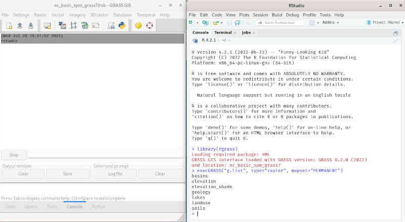
```

### Starting GRASS inside R

From **spgrass6** 0.6-3, it has also been possible to start a GRASS session from a running R session using the `initGRASS()` function. This is done by setting GRASS and environment variables from the R session (https://grass.osgeo.org/grass80/manuals/variables.html). Starting GRASS from R may use a temporary location, or may use an existing GRASS `LOCATION`.

*Temporary GRASS location*

It may be useful to set an environmental variable to the value of `GISBASE`, as shown for example in the GRASS terminal console:

```
GRASS nc_basic_spm_grass7/rsb:github-rsb > echo $GISBASE
/home/rsb/topics/grass/g820/grass82
```

Starting R with such a suitable environment variable set lets us retrieve it later when needed. When loaded and attached, **rgrass** reports that it seems that GRASS is not running:

```
$ GRASS_INSTALLATION=/home/rsb/topics/grass/g820/grass82 R

R version 4.2.1 (2022-06-23) -- "Funny-Looking Kid"
Copyright (C) 2022 The R Foundation for Statistical Computing
Platform: x86_64-pc-linux-gnu (64-bit)

...

> library(rgrass)
Loading required package: XML
GRASS GIS interface loaded with GRASS version: (GRASS not running)
```
Here we'll use a raster file provided with **terra**:

```
> library(terra)
terra 1.6.0
> f <- system.file("ex/elev.tif", package="terra")
> r <- rast(f)
```
The first argument to `initGRASS()` is `gisBase=`, which here we are passing the value of the environmental variable after checking that it is a directory. The second argument is where to write the `GISRC` file. The third is a template raster (here a `"SpatRaster"` object) from which to clone the temporary location size, position, resolution and projection:

```
> GRASS_INSTALLATION <- Sys.getenv("GRASS_INSTALLATION")
> file.info(GRASS_INSTALLATION)$isdir
[1] TRUE
> loc <- initGRASS(gisBase=GRASS_INSTALLATION, home=tempdir(), SG=r, override=TRUE)
```
As can be seen, `initGRASS()` creates not only environment and GRASS variables, but also many files in the location mapsets; `g.gisenv` also shows details:

```
> list.files(file.path(loc$GISDBASE, loc$LOCATION_NAME), recursive=TRUE)
[1] "file28aaf6dc1c44c/WIND"          "file28aaf6dc1c44c/windows/input"
[3] "PERMANENT/DEFAULT_WIND"          "PERMANENT/PROJ_EPSG"            
[5] "PERMANENT/PROJ_INFO"             "PERMANENT/PROJ_SRID"            
[7] "PERMANENT/PROJ_UNITS"            "PERMANENT/PROJ_WKT"             
[9] "PERMANENT/WIND"                 
> execGRASS("g.gisenv")
GISDBASE='/tmp/Rtmpe7QdVd';
LOCATION_NAME='file28aaf5be4b905';
MAPSET='file28aaf6dc1c44c';
GRASS_GUI='text';
```
We may now write R objects to the temporary GRASS location for manipulation and analysis, here calculating slope and aspect layers:

```
> write_RAST(r, vname="terra_elev")
Importing raster map <terra_elev>...
 100%
SpatRaster read into GRASS using r.in.gdal from file 
> execGRASS("g.list", type="raster", mapset=loc$MAPSET)
terra_elev
> execGRASS("r.slope.aspect", flags="overwrite", elevation="terra_elev", slope="slope", aspect="aspect")
 100%
Aspect raster map <aspect> complete
Slope raster map <slope> complete
> u1 <- read_RAST(c("terra_elev", "slope", "aspect"))
Checking GDAL data type and nodata value...
 100%
Using GDAL data type <UInt16>
Exporting raster data to RRASTER format...
 100%
r.out.gdal complete. File </tmp/RtmpLsAbI6/file29f4b33cd20f6.grd> created.
Checking GDAL data type and nodata value...
 100%
Using GDAL data type <Float32>
Exporting raster data to RRASTER format...
 100%
r.out.gdal complete. File </tmp/RtmpLsAbI6/file29f4b2d2e045b.grd> created.
Checking GDAL data type and nodata value...
 100%
Using GDAL data type <Float32>
Exporting raster data to RRASTER format...
 100%
r.out.gdal complete. File </tmp/RtmpLsAbI6/file29f4b52cab445.grd> created.
> u1
class       : SpatRaster 
dimensions  : 90, 95, 3  (nrow, ncol, nlyr)
resolution  : 0.008333326, 0.008333333  (x, y)
extent      : 5.741667, 6.533333, 49.44167, 50.19167  (xmin, xmax, ymin, ymax)
coord. ref. : lon/lat WGS 84 (EPSG:4326) 
sources     : file29f4b33cd20f6.grd  
              file29f4b2d2e045b.grd  
              file29f4b52cab445.grd  
names       :   terra_elev,        slope,       aspect 
min values  : 141.00000000,   0.01416342,   0.08974174 
max values  :   547.000000,     7.229438,   360.000000 
```

*Existing GRASS location*

Similarly, GRASS may be started in an R session by providing the `gisDbase=`, "`location=` and `mapset=` arguments with valid values:

```
$ GRASS_INSTALLATION=/home/rsb/topics/grass/g820/grass82 R

R version 4.2.1 (2022-06-23) -- "Funny-Looking Kid"
Copyright (C) 2022 The R Foundation for Statistical Computing
Platform: x86_64-pc-linux-gnu (64-bit)

...

> library(rgrass)
Loading required package: XML
GRASS GIS interface loaded with GRASS version: (GRASS not running)
> GRASS_INSTALLATION <- Sys.getenv("GRASS_INSTALLATION")
> loc <- initGRASS(GRASS_INSTALLATION, home=tempdir(), gisDbase="/home/rsb/topics/grassdata", location="nc_basic_spm_grass7", mapset="rsb", override=TRUE)
> execGRASS("g.gisenv")
GISDBASE='/home/rsb/topics/grassdata';
LOCATION_NAME='nc_basic_spm_grass7';
MAPSET='rsb';
GRASS_GUI='text';
> execGRASS("g.list", type="raster", mapset="PERMANENT")
basins
elevation
elevation_shade
geology
lakes
landuse
soils
```
## Coercion between object representations

The current version of the R-GRASS interface has been simplified to use the **terra** package because it, like **sf** and **rgdal** before it, links to the important external libraries. The workhorse driver is known as `RRASTER`, and has been widely used in **raster** and **terra** (see also (https://rspatial.org)). It uses GDAL but writes a flat uncompressed binary file. Using `terra::rast()` also appears to preserve category names and colour tables, but needs further testing (see (https://github.com/rsbivand/rgrass/issues/42)).

From GDAL 3.5.0, the `RRASTER` driver also supports WKT2_2019 CRS representations; in earlier versions of GDAL, the driver only supported the proj-string representation (https://github.com/rsbivand/rgrass/issues/51).

These changes mean that users transferring data between R and GRASS will need to coerce between **terra** classes `SpatVector` and `SpatRaster` and the class system of choice. In addition, `SpatRaster` is only read into memory from file when this is required, so requiring some care.

On loading and attaching, **terra** displays its version:

```{r}
library("terra")
```

This description is constructed conditioning on the availability of suggested packages. `terra::gdal()` tells us the versions of the external libraries being used by **terra**:

```{r}
gdal(lib="all")
```

When using CRAN binary packages built static for Windows and macOS, the R packages will use the same versions of the external libraries, but not necessarily the same versions as those against which GRASS was installed.


### `"SpatVector"` coercion

In the **terra** package [@terra], vector data are held in `"SpatVector"` objects. This means that when `read_VECT()` is used, a `"SpatVector"` object is returned, and the same class of object is needed for `write_VECT()` for writing to GRASS.


```{r}
fv <- system.file("ex/lux.shp", package="terra")
(v <- vect(fv))
```

These objects are always held in memory, so there is no `inMemory()` method:

```{r}
try(inMemory(v))
```

The coordinate reference system is expressed in WKT2-2019 form:

```{r}
cat(crs(v), "\n")
```

#### `"sf"`

Most new work should use vector classes defined in the **sf** package [@sf; @sf-rj]. 

```{r}
library("sf")
```


In this case, coercion uses `st_as_sf()`:

```{r}
v_sf <- st_as_sf(v)
v_sf
```

and the `vect()` method to get from **sf** to **terra**:

```{r}
v_sf_rt <- vect(v_sf)
v_sf_rt
```

```{r}
all.equal(v_sf_rt, v, check.attributes=FALSE)
```

#### `"Spatial"`

To coerce to and from vector classes defined in the **sp** package [@asdar], use the classes defined in **sf** as an intermediate step:

```{r}
Sys.setenv("_SP_EVOLUTION_STATUS_"="2")
library("sp")
```
```{r}
v_sp <- as(v_sf, "Spatial")
print(summary(v_sp))
```

```{r}
v_sp_rt <- vect(st_as_sf(v_sp))
all.equal(v_sp_rt, v, check.attributes=FALSE)
```

### `"SpatRaster"` coercion

In the **terra** package, raster data are held in `"SpatRaster"` objects. This means that when `read_RAST()` is used, a `"SpatRaster"` object is returned, and the same class of object is needed for `write_RAST()` for writing to GRASS.

```{r}
fr <- system.file("ex/elev.tif", package="terra")
(r <- rast(fr))
```

In general, `"SpatRaster"` objects are files, rather than data held in memory:

```{r}
try(inMemory(r))
```

#### `"stars"`

The **stars** package [@stars] uses GDAL through **sf**:

```{r}
library("stars")
```

A coercion method is provided from `"SpatRaster"` to `"stars"`:

```{r}
r_stars <- st_as_stars(r)
print(r_stars)
```
which round-trips in memory. 

```{r}
(r_stars_rt <- rast(r_stars))
```

When coercing to `"stars_proxy"` the same applies:

```{r}
(r_stars_p <- st_as_stars(r, proxy=TRUE))
```
with coercion from `"stars_proxy"` also not reading data into memory:

```{r}
(r_stars_p_rt <- rast(r_stars_p))
```

#### `"Spatial"`

Coercion to the **sp** `"SpatialGridDataFrame"` representation is provided by **stars**:

```{r}
r_sp <- as(r_stars, "Spatial")
summary(r_sp)
```

and can be round-tripped:

```{r}
(r_sp_rt <- rast(st_as_stars(r_sp)))
```

### `"RasterLayer"`

From version 3.6-3 the **raster** package [@raster] uses **terra** for all GDAL operations. Because of this, coercing a `"SpatRaster"` object to a `"RasterLayer"` object is simple:

```{r}
library(raster)
(r_RL <- raster(r))
```
```{r}
inMemory(r_RL)
```

This object (held on file rather than in memory) can be round-tripped:

```{r}
(r_RL_rt <- rast(r_RL))
```


## Example: Broad Street Cholera outbreak 1854

Even though we know that John Snow already had a working
hypothesis about cholera epidemics, his data remain interesting,
especially if we use a GIS to find the street distances from
mortality dwellings to the Broad Street pump in Soho in central
London. @brodyetal:00 point out that John Snow did not use
maps to 'find' the Broad Street pump, the polluted water source
behind the 1854 cholera epidemic, because he associated cholera
with water contaminated with sewage, based on earlier experience.

```{r, out.width=800, echo=FALSE}
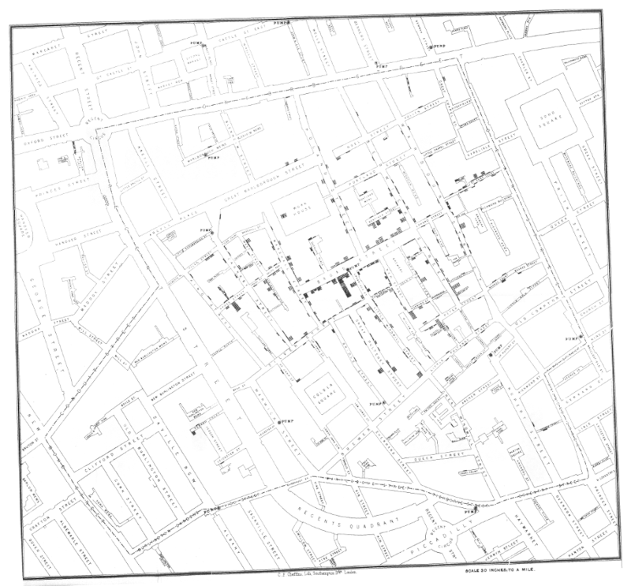
```


### Broad Street Cholera Data

The basic data to be used here were made available by Jim Detwiler, who had collated them for David O'Sullivan for use on the cover of @osullivan+unwin:03, based on earlier work by Waldo
Tobler and others. The files were a shapefile of counts of deaths at front doors of houses, two shapefiles of pump locations and a georeferenced copy of the Snow map as an image; the files were registered in the British National Grid CRS. In GRASS, a suitable location was set up in this CRS and the image file was imported; the building contours were then digitised as a vector layer and cleaned.


```{r, out.width=340, echo=FALSE}
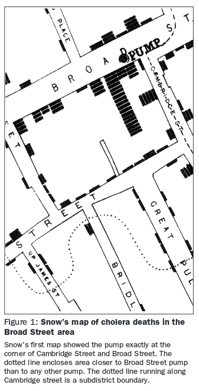
```

We would like to find the line of equal distances shown on the extract from John Snow's map shown in @brodyetal:00 shown here, or equivalently find the distances from the pumps to the front doors of houses with mortalities following the roads, not the straight line distance. We should recall that we only have the locations of counts of mortalities, not of people at risk or of survivors.

We'll use `"SpatVector"` as a basis for spatial object representation, and the **terra** package for reading and writing spatial data files, here the extent of the digitized buildings:

```{r}
library(terra)
bbo <- vect("data/bbo.gpkg")
bbo
```

Next, we create a `"SpatRaster"` object with 1m resolution covering the extent of the buildings in EW/NS orientation (a bounding box):

```{r}
bbo_r <- rast(bbo, resolution=1)
bbo_r
```
We'll read the vector data: digitized building outlines, front door points, and pump locations, into the R session:

```{r}
buildings <- vect("data/buildings.gpkg")
deaths <- vect("data/deaths.gpkg")
b_pump <- vect("data/b_pump.gpkg")
nb_pump <- vect("data/nb_pump.gpkg")
```

```{r}
plot(buildings)
points(deaths)
points(b_pump, pch=7, col="red", cex=1.5)
points(nb_pump, pch=1, col="blue", cex=1.5)
```


### Instantiating GRASS

As noted above, the value of the environment variable `GISBASE` set in a live GRASS session is where GRASS lives:

```{r}
Sys.setenv("GRASS_INSTALLATION"="/home/rsb/topics/grass/g820/grass82")
library(rgrass)
GRASS_INSTALLATION <- Sys.getenv("GRASS_INSTALLATION")
file.info(GRASS_INSTALLATION)$isdir[1]
GRASS_INSTALLATION
```
We also need a place to put the temporary GRASS location:

```{r}
td <- tempdir()
td
```
Here we need the three objects we have already created, and also set `override=TRUE`, as this document may be run many times. `initGRASS()` looks for an environment variable that GRASS sessions set (`GISRC`) pointing to a file of GRASS environment variables. Real GRASS sessions remove it on exit, but this interface does not (yet) provide for its removal, hence the need here to override.

With **rgrass** and using a `"SpatRaster"` object `bbo_r` to set up the GRASS location, we can set the projection, extent and resolution much more easily than in previous versions of the interface:

```{r}
soho <- initGRASS(gisBase=GRASS_INSTALLATION, home=td, SG=bbo_r, override=TRUE)
soho
```
Next we write the spatial data objects to the GRASS temporary LOCATION and MAPSET, taking only the first column of the buildings object. Now the interface by default uses Geopackage (GPKG) intermediate files, supporting long field names and UTF-8 encoding:

```{r}
fl <- c("overwrite", "quiet")
write_VECT(bbo, vname="bbo", flags=fl)
write_VECT(buildings[,1], vname="buildings", flags=fl)
write_VECT(b_pump, vname="b_pump", flags=fl)
write_VECT(nb_pump, vname="nb_pump", flags=fl)
write_VECT(deaths, vname="deaths", flags=fl)
execGRASS("g.list", type="vector", intern=TRUE)
```

### Data processing

First, we cut the buildings out of the extent polygon to leave the roads. Having set the region resolution to 1x1m squares we can convert the vector roads to raster, and can tabulate raster cell values, where the asterisk (*) are missing data cells:

```{r}
execGRASS("v.overlay", ainput="buildings", binput="bbo", operator="xor", output="roads", flags=fl)
execGRASS("v.to.rast", input="roads", output="rroads", use="val", value=1, flags=fl)
execGRASS("r.stats", input="rroads", flags=c("c", "quiet"))
```
We also need to buffer out the roads by an amount sufficient to include the the front door points within the roads - 4m was found by trial and error and may be too much, giving shorter distances than a thinner buffer would yield. Reclassification of the raster to give only unit cost is also needed:

```{r}
execGRASS("r.buffer", input="rroads", output="rroads4", distances=4, flags=fl)
execGRASS("r.stats", input="rroads4", flags=c("c", "quiet"))
tf <- tempfile()
cat("1 2 = 1\n", file=tf)
execGRASS("r.reclass", input="rroads4", output="rroads4a", rules=tf, flags=fl)
execGRASS("r.stats", input="rroads4a", flags=c("c", "quiet"))
```
The `r.cost` command returns a raster with cells set as the cost of moving from the vector start point or points to each cell; we do this twice, once for the Broad Street pump, and then for the other pumps:

```{r}
execGRASS("r.cost", input="rroads4a", output="dist_broad", start_points="b_pump", flags=fl)
execGRASS("r.cost", input="rroads4a", output="dist_not_broad", start_points="nb_pump", flags=fl)
```

Finally, we examine the values of these two distance maps at the front door points, and add these fields (columns) to the vector mortality map:

```{r}
execGRASS("v.db.addcolumn", map="deaths", columns="broad double precision", flags="quiet")
execGRASS("v.what.rast", map="deaths", raster="dist_broad", column="broad", flags="quiet")
execGRASS("v.db.addcolumn", map="deaths", columns="not_broad double precision", flags="quiet")
execGRASS("v.what.rast", map="deaths", raster="dist_not_broad", column="not_broad", flags="quiet")
```

Moving the data back to R from GRASS permits operations on the distance values. We set the logical variable `b_nearer` to `TRUE` if the distance to the Broad Street pump is less than the distance to the nearest other pump:

```{r}
deaths1 <- read_VECT("deaths", flags=fl)
deaths1$b_nearer <- deaths1$broad < deaths1$not_broad
```

```{r}
by(deaths1$Num_Css, deaths1$b_nearer, sum)
```

### Just with **terra**?

In https://rsbivand.github.io/geomed19-workshop/Geomed19_II.html, it was shown that **raster** and **gdistance** could be used to analyze the same problem. Times have moved on, so let's try **terra**, first buffering the roads out by 4m (buildings in by 4m):

```{r}
buildings_4 <- buffer(buildings, width=-4)
```

Next we rasterize the negative buffered buildings using `bbo_r` created above:

```{r}
buildings_4_r <- rasterize(buildings_4, bbo_r, field="cat")
```

and recode the values to set the negative buffered buildings to a large value and the roads to the value of the resolution:

```{r}
values(buildings_4_r)[!is.na(values(buildings_4_r))] <- 99999
values(buildings_4_r)[is.na(values(buildings_4_r))] <- 1
```

Next, rasterize the pump locations to the same resolution template:

```{r}
b_pump_r <- rasterize(b_pump, bbo_r, field="cat")
nb_pump_r <- rasterize(nb_pump, bbo_r, field="cat")
```

Copy the recoded negative buffered buildings raster, and overwrite with the location of the Broad Street pump set to zero, then run `costDistance()`:

```{r}
b_buildings_4_r <- buildings_4_r
values(b_buildings_4_r)[which(values(b_pump_r) == 1)] <- 0
res_b <- costDistance(b_buildings_4_r, target=0)
```

Repeat for the non-Broad Street pumps:

```{r}
nb_buildings_4_r <- buildings_4_r
values(nb_buildings_4_r)[which(values(nb_pump_r) > 0)] <- 0
res_nb <- costDistance(nb_buildings_4_r, target=0)
```

Extract the distances to the Broad Street and nearest non-Broad Street pumps by the locations of the front doors of houses where deaths were registered:

```{r}
b_deaths <- extract(res_b, deaths)
nb_deaths <- extract(res_nb, deaths)
```

Find, for each such address, whether the Broad Street pump was nearer or not:

```{r}
broad_nearer <- b_deaths$cat < nb_deaths$cat
```

Sum how many deaths occurred for addresses for which the Broad Street pump was nearer or not:

```{r}
by(deaths$Num_Css, broad_nearer, sum)
```

The outcome is the same as the analysis above using GRASS.


## Geodemographics

Unless spatially-constrained clustering is required (SKATER), the functions and packages listed in https://cran.r-project.org/view=Cluster should serve well.


## GRASS/landscapemetrics comparison

https://grass.osgeo.org/grass82/manuals/r.li.html describes the `r.li` toolset in GRASS. This is extended by the https://grass.osgeo.org/grass82/manuals/addons//r.forestfrag.html add-on describing a specific index. 

Could something from openlandmap.org be used as an example? https://openlandmap.org/#/?base=Stamen%20(OpenStreetMap)&center=60.4125,5.1477&zoom=10.5&opacity=40&layer=lcv_land.cover_esacci.lc.l4_c&time=1992

Files lcv_land.cover_esacci.lc.l4_c.csv and bergen_LC_1_24.tif.
`gdal_translate -projwin 4.74 60.60 5.58 60.30 scratch/ESACCI-LC-L4-LCCS-Map-300m-P1Y-1992_2015-v2.0.7.tif bergen_LC_1_24.tif`


## Spatio-temporal cubes

https://r-spatial.org/book/06-Cubes.html
https://r-spatial.org/book/09-Large.html
https://cran.r-project.org/package=stars
https://cran.r-project.org/package=starsExtra
https://cran.r-project.org/package=gdalcubes
https://cran.r-project.org/package=openeo
https://cran.r-project.org/package=sits

## Juridicial (boundary) changes

https://cran.r-project.org/package=areal
https://r-spatial.github.io/sf/reference/interpolate_aw.html

https://cran.r-project.org/view=OfficialStatistics
https://cran.r-project.org/package=geoSAE
https://cran.r-project.org/package=rsae

https://cran.r-project.org/package=redist
https://cran.r-project.org/package=geomander
