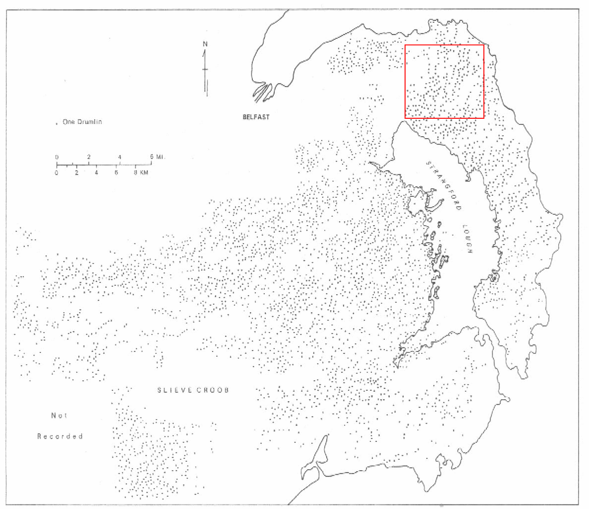
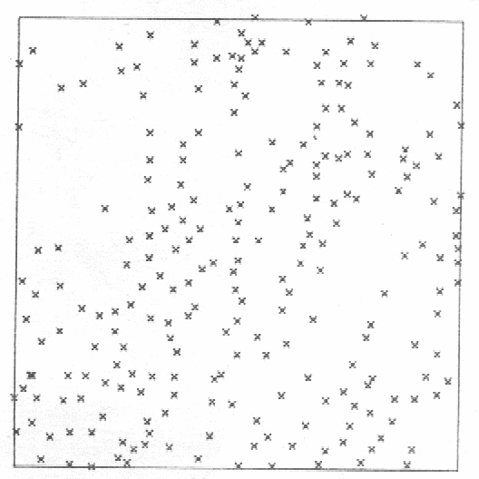

```{r setup, include=FALSE}
knitr::opts_chunk$set(echo = TRUE, paged.print=FALSE)
```

### Copyright

All the material presented here, to the extent it is original, is available under [CC-BY-SA](https://creativecommons.org/licenses/by-sa/4.0/). 

## Plan for 17-18 November 2022

### Thursday 17/11

09:00-12:00 Spatial autocorrelation and machine learning; Point pattern analysis; Transport, networks, transmission

13:00-15:45 Project consultations

### Friday 18/11

Depending on the number of participants wishing to present project outlines (about 20 minutes, 10-ish minutes presentation, 10-ish minutes discussion, the number of slots may vary.

09:00-12:00 Presentation of about seven project outlines, with 20 min. break.

12:30-15:30 Presentation of  about seven project outlines, with 20 min. break.

15:30-16:00 Round-up and feedback


## Spatial autocorrelation and machine learning

https://spatialsample.tidymodels.org/index.html
https://mlr3spatial.mlr-org.com/
https://mlr3spatiotempcv.mlr-org.com/
https://cran.r-project.org/package=blockCV


## Point pattern analysis

### Outline

What we see on a map is a pattern, or perhaps some patterns mixed
together.

It is not easy to work back from map pattern to the process or
processes that generated it/them.

Using a variety of approaches, we can explore and analyse point
patterns, also reviewing an important chapter in the development of
quantitative geography.

Practically, we will also see how we can try out different
approaches, and how their assumptions affect our conclusions.


### References

David O'Sullivan and David Unwin (2003) \emph{Geographical Information
Analysis}, Wiley, chapter 4, plus chapter 3 for the curious (or 2010, ch. 5 plus ch. 4);

Ian Smalley and David Unwin (1968) The formation and shape of
drumlins and their distribution and orientation in drumlin fields,
\emph{Journal of Glaciology}, 7, pp. 377--390; Alan R. Hill (1973) The distribution of drumlins in County Down, Ireland, \emph{Annals, AAG}, 63 (2). pp. 226--240.

Others may also like Trevor Bailey and Anthony Gatrell (1995) \emph{Interactive spatial data analysis}, Longman, chapter 3.


### Data, drumlins, County Down, Ireland

```{r, echo = TRUE}
library(sf)
drumlins <- st_geometry(st_read("drumlins.gpkg"))
```

A data set similar to the one refered to by O'Sullivan and Unwin on p. 100-101 is available in **spatial** in R (associated with Venables and Ripley (2002) Modern Applied Statistics with S) --- it is the one used by Upton and Fingleton, coded by Ripley. We have here copied the points to a shapefile.







### Using **spatstat** with **sf**


```{r, echo = TRUE}
library(spatstat)
(drumlins_ppp <- as.ppp(drumlins))
```

Although **spatstat** and the **sp** classes have developed independently, they have a good deal in common, and point patterns, images and polygon windows can be exchanged


### Edges and plot


Point pattern objects need bounding windows to show where the population of data points were collected. The default window is the bounding box of the points, but others are available.

```{r, echo = TRUE}
bb <- boundingbox(drumlins_ppp)
ch <- convexhull.xy(drumlins_ppp)
rr <- ripras(drumlins_ppp)
drumlins_rr <- ppp(drumlins_ppp$x, drumlins_ppp$y, window=rr)
```


```{r, echo=TRUE}
plot(drumlins_ppp)
plot(bb, add=TRUE, border="darkgreen", lwd=2, lty=1)
plot(ch, add=TRUE, border="darkred", lwd=2, lty=3)
plot(rr, add=TRUE, border="orange", lwd=2, lty=2)
```


### Quadrat analysis


One legacy approach to point patterns, avoiding the drudge of measuring inter-point distances, has been to divide the study area into quadrats, and count the numbers of points falling into each quadrat. This can take the form of a 2D histogram, or be displayed as an image plot.

```{r, echo = TRUE}
qc <- quadratcount(drumlins_ppp)
```


```{r, echo=TRUE}
plot(drumlins, cex=0.8)
t3 <- cbind(expand.grid(x=attr(qc, "xbreaks")[1:5] + diff(attr(qc, "xbreaks"))[1]/2, y=rev(attr(qc, "ybreaks")[1:5] + diff(attr(qc, "ybreaks"))[1]/2)), qc=c(t(qc)))
text(t3[,1], t3[,2], t3[,3], cex=1.2, font=2, col="darkred")
abline(h=attr(qc, "ybreaks"))
abline(v=attr(qc, "xbreaks"))
```

 

### Quadrat tests

Chi-squared tests for Complete Spatial Randomness using quadrat counts may seem attractive, but suffer from the same problems as do histogram bins:

```{r, echo = TRUE}
quadrat.test(drumlins_ppp)
```


Just adding one more row and column of quadrats, or switching windows, changes our conclusion:

```{r, echo = TRUE}
quadrat.test(drumlins_ppp, nx=6)
quadrat.test(drumlins_rr)
```


### Density plots

Density plots use a 2D kernel, in **spatstat** a Gaussian kernel, to create smoothed histograms avoiding the problems of quadrat counts. The key argument to pass to the density method for point patterm objects is `sigma=`, which determines the bandwidth of the kernel. Since we can coerce the image objects output by the method to an **sp** class, we use this to cumulate density values for different values of sigma.

```{r, echo = TRUE}
crds <- crds <- st_coordinates(st_sample(st_as_sfc(rr), size=10000, type="regular"))
crds <- list(x=crds[,1], y=crds[,2])
library(raster)
k02 <- as(density(drumlins_rr, sigma=0.2, xy=crds), "RasterLayer")
k04 <- as(density(drumlins_rr, sigma=0.4, xy=crds), "RasterLayer")
k06 <- as(density(drumlins_rr, sigma=0.6, xy=crds), "RasterLayer")
k08 <- as(density(drumlins_rr, sigma=0.8, xy=crds), "RasterLayer")
rB <- brick(k02, k04, k06, k08)
library(stars)
rB_st <- st_as_stars(rB)
```


```{r, echo=TRUE}
library(tmap)
st_crs(rB_st) <- 32662
st_crs(drumlins) <- 32662
tm_shape(rB_st) + tm_raster(title="Density") + tm_layout(panel.labels=c("0.2", "0.4", "0.6", "0.8")) + tm_shape(drumlins) + tm_symbols(size=0.25, shape=4)
```


Narrower bandwidths yield more extreme values, broader bandwidths narrow the interquartile range. From this table, we can see how the change in the bandwidth is affecting the relative differences in our view of the local estimates of intensity.

```{r, echo = TRUE}
summary(rB)
```

```{r, echo = TRUE}
boxplot(rB)
```

### Nearest-neighbour distances


We can find and plot nearest neighbour distances, finding them with `nndist` --- plotting the empirical cumulative distribution function of the nearest neighbour distances is interesting:

```{r, echo = TRUE}
nns <- nndist(drumlins_rr)
summary(nns)
```


```{r, echo=TRUE}
plot(ecdf(nns))
```


### Using G-hat - empirical cumulative distribution function


The $\hat{G}$ measure turns out to be just the ECDF of the nearest neighbour distances, plotted by default with the expected CSR line; `Gest` returns binned values for a range of distance bins best chosen by the function:

```{r, echo = TRUE, eval=FALSE}
plot(ecdf(nns), xlim=c(0, 0.5))
plot(Gest(drumlins_ppp), add=TRUE, lwd=3)
```


If we generate many simulated CSR point patterns for the current window, we can use the `envelope` method to explore whether the observed $\hat{G}$ measures lie in relation to the simulated ones:

```{r, echo = TRUE}
n <- drumlins_rr$n
set.seed(121122)
ex <- expression(runifpoint(n, win=rr))
res <- envelope(drumlins_rr, Gest, nsim=99, simulate=ex, 
        verbose=FALSE, savefuns=TRUE)
```


```{r , echo=TRUE}
plot(res, xlim=c(0,0.7))
for(i in 2:100) lines(attr(res, "simfuns")[[1]], attr(res, "simfuns")[[i]], col="grey")
plot(res, add=TRUE, lwd=3, xlim=c(0,0.7))
```

 


### Clark/Evans R statistics

We can also compute the nearest neighbour based Clark/Evans R statistic :

```{r, echo = TRUE}
clarkevans(drumlins_ppp)
clarkevans(drumlins_rr, correction="none")
clarkevans(drumlins_rr, correction="guard", clipregion=erosion.owin(rr, r=1))
```


which seem to indicate that the observed and CSR expected distances are similar, but perhaps more evenly spaced than clustered.


### Was CSR a good idea?

From what we have seen, it appears the the drumlin summit points are more regularly than randomly distributed. If we think, however, the absence of short nearest neighbour distance may mean that they "push" each other apart (in fact this is about points not being a good way of representing ellipses) --- so we can try to simulate from a Simple Sequential Inhibition (SSI) process with a 180m inhibition radius instead of CSR:


```{r, echo = TRUE, cache=TRUE}
ex <- expression(rSSI(0.18, n, win=rr))
set.seed(121122)
res <- envelope(drumlins_rr, Gest, nsim=99, simulate=ex, 
                verbose=FALSE, savefuns=TRUE)
```


```{r, echo=TRUE}
null <- capture.output(plot(res, xlim=c(0,0.7)))
for(i in 2:100) lines(attr(res, "simfuns")[[1]], attr(res, "simfuns")[[i]], col="grey")
null <- capture.output(plot(res, add=TRUE, lwd=3, xlim=c(0,0.7)))
```


### K-hat with CSR simulation


As we know, G-hat uses nearest neighbour distances to express summary features of a point pattern. The K-hat function uses point intensities in rings spreading out from the points, and so uses more of the data to examine what is driving the process (reported here as L-hat):

```{r, echo = TRUE, cache=TRUE}
ex <- expression(runifpoint(n, win=rr))
set.seed(121122)
res <- envelope(drumlins_rr, Kest, nsim=99, simulate=ex, 
                verbose=FALSE, savefuns=TRUE)
```


```{r, echo=TRUE}
r <- res$r
Lhat <- function(k, r) { (sqrt(k/pi)) - r }
plot(r, Lhat(res$obs, r), type="n", ylab="L(r)", main="CSR simulation", ylim=c(-0.17, 0.1))
for(i in 2:100) lines(r, Lhat(attr(res, "simfuns")[[i]], r), col="grey")
lines(r, Lhat(res$obs, r), lwd=2, col="brown")
lines(r, Lhat(res$lo, r), lwd=2, col="black", lty=2)
lines(r, Lhat(res$hi, r), lwd=2, col="black", lty=2)
```

### K-hat with SSI simulation


From what we already know, drumlins represented as points appear to inhibit each other under a distance of about 200m, so running the $\hat{K}$ measure with an SSI process should show more of what is going on:

```{r, echo = TRUE, cache=TRUE}
ex <- expression(rSSI(0.18, n, win=rr))
set.seed(121122)
res <- envelope(drumlins_rr, Kest, nsim=99, simulate=ex, 
                verbose=FALSE, savefuns=TRUE)
```


```{r, echo=TRUE}
r <- res$r
Lhat <- function(k, r) { (sqrt(k/pi)) - r }
plot(r, Lhat(res$obs, r), type="n", ylab="L(r)", main="SSI simulation", ylim=c(-0.17, 0.1))
for(i in 2:100) lines(r, Lhat(attr(res, "simfuns")[[i]], r), col="grey")
lines(r, Lhat(res$obs, r), lwd=2, col="brown")
lines(r, Lhat(res$lo, r), lwd=2, col="black", lty=2)
lines(r, Lhat(res$hi, r), lwd=2, col="black", lty=2)
```


### Inhomogeneous K-hat with CSR simulation


Another possibility is that the CSR hypothesis is at error on assuming that the process is homogeneous --- we may also test against an inhomogeneous process using the `Kinhom` function. If its `lambda` argument is omitted, it does leave-one-out kernel smoothing to find $\lambda_i$ by omitting the $i$-th point:

```{r, echo = TRUE, cache=TRUE}
ex <- expression(runifpoint(n, win=rr))
set.seed(121122)
res <- envelope(drumlins_rr, Kinhom, nsim=99, simulate=ex, 
                verbose=FALSE, savefuns=TRUE)
```


```{r, echo=TRUE}
r <- res$r
Lhat <- function(k, r) { (sqrt(k/pi)) - r }
plot(r, Lhat(res$obs, r), type="n", ylab="L(r)", main="CSR simulation", ylim=c(-0.17, 0.1))
for(i in 2:100) lines(r, Lhat(attr(res, "simfuns")[[i]], r), col="grey")
lines(r, Lhat(res$obs, r), lwd=2, col="brown")
lines(r, Lhat(res$lo, r), lwd=2, col="black", lty=2)
lines(r, Lhat(res$hi, r), lwd=2, col="black", lty=2)
```

### Inhomogeneous $\hat{K}$ with SSI simulation


Finally, we round off with an inhomogeneous SSI process:

```{r, echo = TRUE, cache=TRUE}
ex <- expression(rSSI(0.18, n, win=rr))
set.seed(121122)
res <- envelope(drumlins_rr, Kinhom, nsim=99, simulate=ex, 
                verbose=FALSE, savefuns=TRUE)
```


```{r, echo=TRUE}
r <- res$r
Lhat <- function(k, r) { (sqrt(k/pi)) - r }
plot(r, Lhat(res$obs, r), type="n", ylab="L(r)", main="SSI simulation", ylim=c(-0.17, 0.1))
for(i in 2:100) lines(r, Lhat(attr(res, "simfuns")[[i]], r), col="grey")
lines(r, Lhat(res$obs, r), lwd=2, col="brown")
lines(r, Lhat(res$lo, r), lwd=2, col="black", lty=2)
lines(r, Lhat(res$hi, r), lwd=2, col="black", lty=2)
```


### Conclusions about drumlins (so far)

Comparing the SSI with the CSR results indicates that we can not only reject the CSR process as being that driving drumlin point locations, but we have good grounds to suppose that a spatial inhibition process is operating

It is also very possible that the process is inhomogeneous, that is that an omitted heterogeneity in the surface is influencing the point pattern

The minimum drumlin footprint is such that drumlins cannot be closer to each other than a certain minimum distance

At short range, the estimated L-hat values are lower than the lower envelope bounds, but only less than 0.4 distance units --- this corresponds to spatial inhibition

As the L-hat simulation values for the SSI process indicate, drumlins are not well represented by points, because they have area, even volume, and rarely overlap''

### Case/control point patterns

It is frequently the case that point patterns are not measured on homogeneous surfaces

One way to tackle this is, as in these examples from Zhang et al. (2009), to sample from the population at risk to form a control group

We are then interested in examining the spatial distribution of cases compared to the spatial distribution of controls

The cases are observations of schistosomiasis in Guichi, China, and the controls are taken from the polulation at risk

First we'll read in the points, enclosing polygon, and river banks:

```{r, echo = TRUE}
points <- st_read("cc.gpkg", layer="points")
rivers <- st_geometry(st_read("cc.gpkg", layer="rivers"))
poly <- st_geometry(st_read("cc.gpkg", layer="poly"))
```


```{r, echo=TRUE}
plot(poly)
plot(rivers, add=TRUE)
plot(st_geometry(points), pch=3:4, add=TRUE)
```

We coerce the **sp** objects to their **spatstat** representations, the points with marks:

```{r, echo = TRUE}
points$mark <- factor(points$mark)
points.ppp <- as.ppp(points)
points.ppp$window <- as.owin(poly)
summary(points.ppp)
```


```{r, echo=TRUE}
plot(split(points.ppp))
```


### Kernel density


We make a mask for the kernel density calculations, and show the overall density:

```{r, echo = TRUE}
XY <- st_coordinates(st_sample(poly, size=10000, type="regular"))
XY <- list(x=XY[,1], y=XY[,2])
Z <- density(points.ppp, xy=XY)
```


```{r, echo=TRUE}
plot(Z)
```


### Case/control kernels


The split density shows how the point patterns differ:

```{r, echo = TRUE}
Z <- density(split(points.ppp), xy=XY)
```


```{r, echo=TRUE}
plot(Z)
```

### Kernel ratio


We can also display the case density as a proportion of the overall density:

```{r, echo = TRUE}
pCases <- with(Z, eval.im(case/(case + control)))
```


```{r , echo=TRUE}
plot(pCases)
plot(points.ppp, add=TRUE)
```


## Transport, networks, transmission

https://cran.r-project.org/package=osrm
https://cran.r-project.org/package=spflow
https://cran.r-project.org/package=gravity
https://cran.r-project.org/view=Tracking
https://cran.r-project.org/package=surveillance

