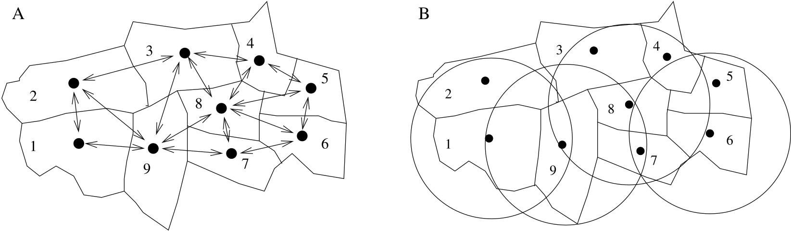
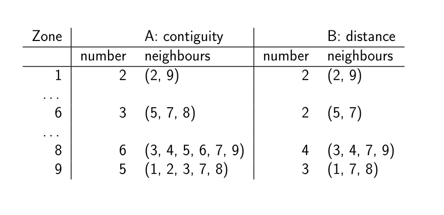
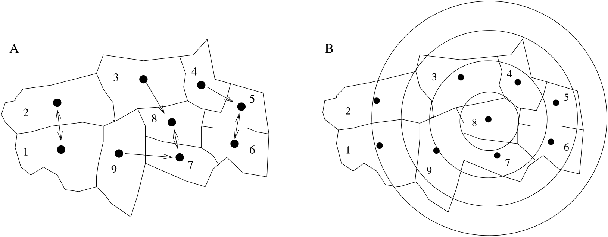
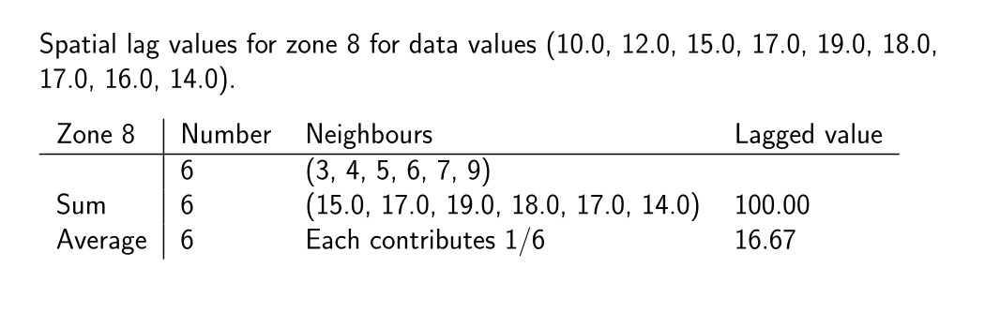

```{r setup, include=FALSE}
knitr::opts_chunk$set(echo = TRUE, paged.print=FALSE)
```

### Copyright

All the material presented here, to the extent it is original, is available under [CC-BY-SA](https://creativecommons.org/licenses/by-sa/4.0/). 

## Follow-up on topic I

Questions about the representation of spatial data.

Questions about the visualization of spatial data.

## Spatial Autocorrelation

The first sections of the ECS530 materials follow from the useR! Toulouse tutorial in 2019: https://github.com/edzer/UseR2019; https://edzer.github.io/UseR2019/part2.html

https://rsbivand.github.io/ECS530_h21/ECS530_211117.html

2020 Wednesday video AM (in Canvas)
https://rsbivand.github.io/ECS530_h20/ECS530_VI.html

https://www.youtube.com/watch?v=vySVctD__Lc&list=PLXUoTpMa_9s10NVk4dBQljNOaOXAOhcE0&index=5
https://rsbivand.github.io/ECS530_h19/ECS530_VI.html

They attempt to return to an unresolved question concerning the identification of the bases for spatial dependence in observed data. You have access to @10.2307/143141 and @10.2307/143140 in Leganto, and even though these are over 50 years old, the questions they raise remain open. @McMillen:2003 is also available. The first is highly cited, the two others little cited, but very probably remain timely voices of concern. The same applies to @brodyetal:00 and @MCLEOD2000923; the narrative of the explanatory power of mapping is also very strong. 

https://en.wikipedia.org/wiki/Spatial_analysis

https://r-spatial.org/book/15-Measures.html#measures-and-process-mis-specification


### Which observations are neighbours?

The relative positions, in geographical rather than attribute space, of the regions defined by the data can be represented in a number of ways. How they are represented, under what assumptions, and using which methods, will impact our measurements of spatial dependence. Some assumptions are more likely to fit some disciplines, others in other situations. The assumed structure of the covariances between the observations does impact many kinds of analysis, not just spatial lattice data.

Spatial weights as a way of expressing which observations are close to each other in some sense, but without necessarily using a distance metric. @bavaud:98 shows how this is related to the propagation involved in Markov chains (while surfaces may be seen as generated by Gaussian Random Fields, tesselations are closer to Markovian Random Fields). The simple, binary, weights matrix assumes very little, basically the presence or absence of a relationship. But this is information, data, that we provide up-front.

 It is usual in the literature to define contiguity relation in terms of sets $N_{(i)}$ of neighbours of zone or site $i$. The $c_{ij} = 1$ if $i$ is linked to $j$ and $c_{ij} = 0$ otherwise. This implies no use of other information than that of neighbourhood set membership. Set membership may be defined on the basis of shared boundaries, of centroids lying within distance bands, or other a priori grounds


```{r, echo=FALSE, out.width=823}
 
```

```{r, echo=FALSE, out.width=879}
 
```

```{r, echo=FALSE, out.width=823}
 
```

```{r, echo=FALSE, out.width=1066}
 
```


https://r-spatial.org/book/14-Areal.html (answers https://edzer.github.io/sdsr_exercises/14.html), https://cran.r-project.org/web/packages/spdep/vignettes/nb_sf.html (based on https://cran.r-project.org/web/packages/spdep/vignettes/nb.html).

### Why does IID (Independent and Identically Distributed) matter?

https://en.wikipedia.org/wiki/Galton's_problem

Why should spatial autocorrelation concern us; what does it affect? Accepting that we would like to utilise the data we have, and that they are autocorrelated for whatever reason, then *not a nuisance* is fair policy. Even if the spatial component isn't interesting, any inference from autocorrelated data will be affected. But we are still building on the weights matrix construction, on assumptions about edge effects, stationarity, etc., that maybe enhance the perceived problems.

Autocorrelation in a sample is important to consider since the
presence of autocorrelation can severely bias the estimation of the
variance of the sample moments. Increasing the simultaneous autocorrelation parameter
$\rho$ has an effect on estimates of the variance of the mean $\sigma^2_{\bar{x}}$. Below, 500 runs are used of samples of $\epsilon$, a random normal variate with zero mean and unit variance on a $7 \times 7$ lattice on a torus (a square
grid mapped onto a circular tube to remove edge effects). Autocorrelation
is introduced into \code{x} by $\mathbf{x} = \sigma (\mathbf{I} - \rho
\mathbf{W})^{-1} \mathbf{\epsilon}$, where $w_{ij} > 0$ when $i, j$ are
neighbours, under certain conditions on $\rho$.

The data are represented by $(\mathbf{I} - \rho
\mathbf{W}) \mathbf{x} =  \mathbf{\epsilon}$, and $\mathbf{\epsilon}$ is free from correlation (and has constant variance; independent identically distributed random deviate). This is the process we would like to simulate (but this also points up the possibility that heteroskedasticity can *look like* spatial dependence). This is the SAR model, most often used in the spatial econometrics tradition. The conditional autoregressive model (see Besag) is more common in other settings, and is used in WinBUGS/GeoBUGS, there is an simultaneous moving average model.

So a little simulation: Let us first try 500 runs on a $10 \times 10$ lattice on a torus, using the row-standardised style. Using 100 units lets us repeat the simulation for North Carolina, now with clear differences between the counties by numbers of neighbours, again with "W" style. The simulations show how far the standard error of the mean ``wanders'' from its theoretical position under positive autocorrelation. This is equivalent to a loss of degrees of freedom, although there is no general mapping between the two (Tylor/Galton).

To make the simulation, we first generate a neighbour list for a $10 \times 10$ lattice on a torus, generate a matrix of 500 random normal (0, 1) values for each of the 100 spatial units, and create the spatially autocorrelated data for chosen values of the autocorrelation parameter. Having done this, we record the variance of the mean for each of the 500 draws:

Impacts: 10 by 10 torus, W style: The mean and median simulated values of the variance of the mean move rightwards as spatial dependence increases, as does its standard deviation. Information is lost as the number of observations needed for one *independent* observation increases, and the total *effective* number of observations falls:

```{r}
nb10rt <- spdep::cell2nb(10, 10, torus=TRUE)
set.seed(20050519)
x <- matrix(rnorm(500*length(nb10rt)), nrow=length(nb10rt))
res0 <- apply(spatialreg::invIrM(nb10rt, rho=0.0) %*% x, 2, function(x) var(x)/length(x))
res2 <- apply(spatialreg::invIrM(nb10rt, rho=0.2) %*% x, 2, function(x) var(x)/length(x))
res4 <- apply(spatialreg::invIrM(nb10rt, rho=0.4) %*% x, 2, function(x) var(x)/length(x))
res6 <- apply(spatialreg::invIrM(nb10rt, rho=0.6) %*% x, 2, function(x) var(x)/length(x))
res8 <- apply(spatialreg::invIrM(nb10rt, rho=0.8) %*% x, 2, function(x) var(x)/length(x))
res9 <- apply(spatialreg::invIrM(nb10rt, rho=0.9) %*% x, 2, function(x) var(x)/length(x))
plot(density(res9), col="red", xlim=c(-0.01, max(density(res9)$x)),
 ylim=range(density(res0)$y), xlab="estimated variance of the mean", main="", lwd=3)
lines(density(res0), col="black", lwd=3)
lines(density(res2), col="brown", lwd=3)
lines(density(res4), col="green", lwd=3)
lines(density(res6), col="orange", lwd=3)
lines(density(res8), col="pink", lwd=3)
title("10 by 10 torus, W style")
legend("topright", lwd=3, legend=c("0.0", "0.2", "0.4", "0.6", "0.8", "0.9"), col=c("black", "brown", "green", "orange", "pink", "red"))
```

```{r}
df <- data.frame("rho=0.0"=res0, "rho=0.2"=res2, "rho=0.4"=res4, "rho=0.6"=res6, "rho=0.8"=res8, "rho=0.9"=res9, check.names=FALSE)
data.frame(mean=apply(df, 2, mean), median=apply(df, 2, median), sd=apply(df, 2, sd), info.loss=apply(df, 2, function(x) mean(x)/mean(res0)), effective.obs=(100/apply(df, 2, function(x) mean(x)/mean(res0))))
```

Impacts: North Carolina, W style; With an irregular lattice, the impacts increase:

```{r}
nc_cont_nb <- spdep::poly2nb(sf::st_transform(sf::st_read(system.file("gpkg/nc.gpkg", package="sf"), quiet=TRUE), "EPSG:32019"))
set.seed(20050519)
x <- matrix(rnorm(500*length(nc_cont_nb)), nrow=length(nc_cont_nb))
res0 <- apply(spatialreg::invIrM(nc_cont_nb, rho=0.0) %*% x, 2, function(x) var(x)/length(x))
res2 <- apply(spatialreg::invIrM(nc_cont_nb, rho=0.2) %*% x, 2, function(x) var(x)/length(x))
res4 <- apply(spatialreg::invIrM(nc_cont_nb, rho=0.4) %*% x, 2, function(x) var(x)/length(x))
res6 <- apply(spatialreg::invIrM(nc_cont_nb, rho=0.6) %*% x, 2, function(x) var(x)/length(x))
res8 <- apply(spatialreg::invIrM(nc_cont_nb, rho=0.8) %*% x, 2, function(x) var(x)/length(x))
res9 <- apply(spatialreg::invIrM(nc_cont_nb, rho=0.9) %*% x, 2, function(x) var(x)/length(x))
plot(density(res9), col="red", xlim=c(-0.01, max(density(res9)$x)),
 ylim=range(density(res0)$y), xlab="estimated variance of the mean", main="", lwd=3)
lines(density(res0), col="black", lwd=3)
lines(density(res2), col="brown", lwd=3)
lines(density(res4), col="green", lwd=3)
lines(density(res6), col="orange", lwd=3)
lines(density(res8), col="pink", lwd=3)
title("North Carolina, W style")
legend("topright", lwd=3, legend=c("0.0", "0.2", "0.4", "0.6", "0.8", "0.9"), col=c("black", "brown", "green", "orange", "pink", "red"))
```


```{r}
df <- data.frame("rho=0.0"=res0, "rho=0.2"=res2, "rho=0.4"=res4, "rho=0.6"=res6, "rho=0.8"=res8, "rho=0.9"=res9, check.names=FALSE)
data.frame(mean=apply(df, 2, mean), median=apply(df, 2, median), sd=apply(df, 2, sd), info.loss=apply(df, 2, function(x) mean(x)/mean(res0)), effective.obs=(100/apply(df, 2, function(x) mean(x)/mean(res0))))
```

### Measures for areal/lattice data

@Bivand2018 and a follow-up: @sauer_oshan_rey_wolf_2021, see also https://r-spatial.org/book/15-Measures.html (answers https://edzer.github.io/sdsr_exercises/15.html), @bivand:22 and my pre-pub "Analytical Environments" as well as other articles in Leganto in Canvas.

### Suggestions

https://fcorowe.github.io/intro-gds/, https://github.com/fcorowe/intro-gds, https://osf.io/vhy2p/

https://book.declaredesign.org/experimental-causal.html#experiments-over-networks

This is possibly something to take up in November? They convery the spatial weights into a dense matrix, but might we rather think of random graphs with the same parametric form?


